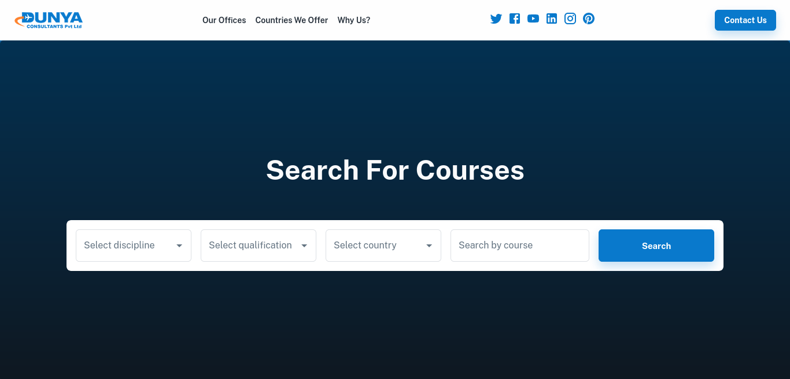
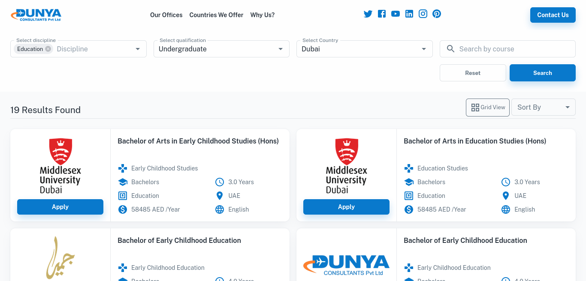

# Dunya Course Finder

Discover educational opportunities worldwide with Dunya Course Finder. This platform empowers users to search for courses available globally and facilitates the entire admission process for specific universities, providing a seamless journey from application to admission. Explore courses, apply for admission, and stay informed about the process, all within a user-friendly interface.

## Technologies

- **MERN Stack:** Utilizing MongoDB, Express.js, React, and Node.js for a full-stack, scalable web application.

- **MUI (Material-UI):** Incorporating MUI as a design system for an intuitive and visually appealing user interface.

- **React Query:** Leveraging React Query for efficient data fetching and state management.

- **Axios:** Employing Axios for making HTTP requests, ensuring smooth communication between the frontend and backend.

- **Nodemailer:** Implementing Nodemailer for email communication to enhance the user experience.

## Live Project

Explore the live version of Dunya Course Finder at [dunyacoursefinder.com](https://dunyacoursefinder.com/).

## Screenshots

_Header section - fill fields to search for courses_

_Search results - click on apply to submit submission form_
