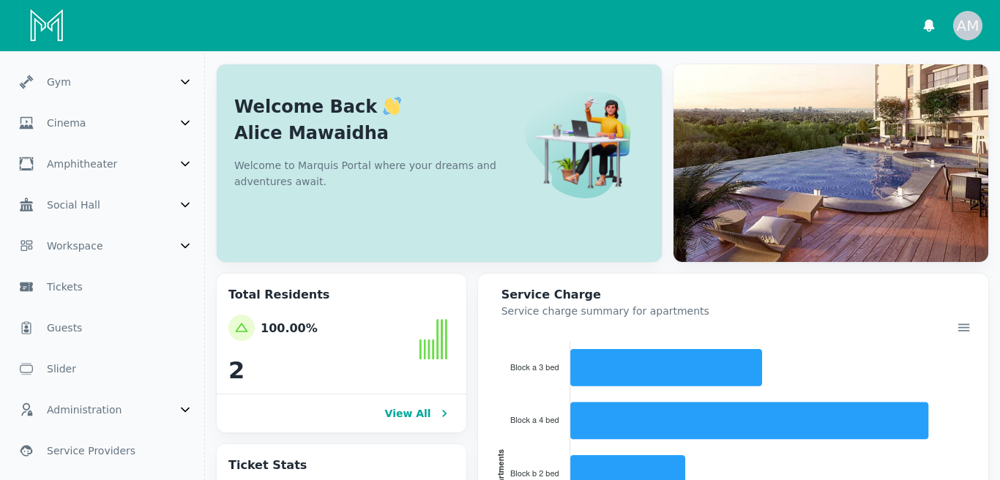
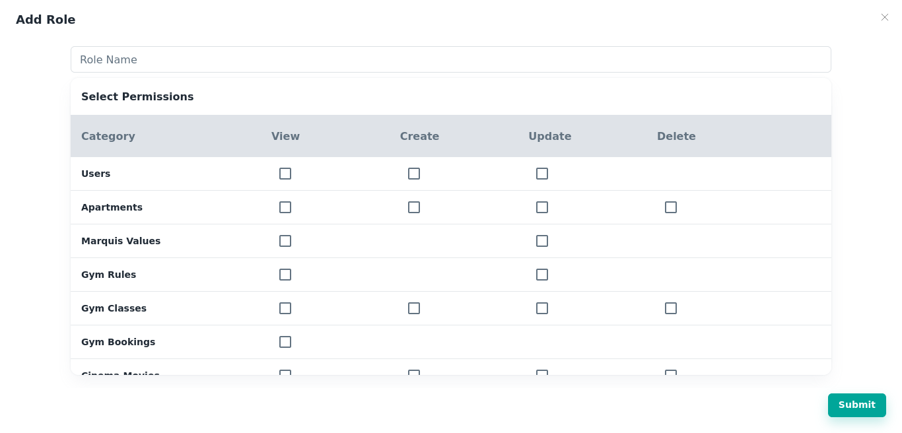

# Marquis - Residents Management System

A comprehensive solution designed to streamline the administration of residents living in apartments. The system empowers administrators to efficiently handle resident details, manage apartment information, and oversee various amenities, including gym classes, cinema bookings, workspaces, and guest arrivals. With custom role management, automatic payouts, real-time notifications, and a built-in messaging system, this project aims to simplify the management of residential complexes.

## Features

- **Resident Management:** Add residents, send login details via email, and block/unblock access to the mobile application.

- **Apartment Details and Pricing:** Manage apartment information, including details and pricing.

- **Gym Management:** Set gym policies, schedule classes, and view bookings for residents.

- **Cinema Seat Booking:** Implement a cinema booking system for movie screenings, including proper seat reservations.

- **Workspace Management:** Manage workspaces and bookings for residents.

- **Ticketing System:** Record and manage tickets raised by residents for various issues.

- **Guest Management:** Record and manage arriving guests, including date and details.

- **Custom Role Management:** Add employees with specific permissions, such as receptionists handling guest-related details.

- **Automatic Payouts:** Process automatic payouts each month on the registered date for residents.

- **Real-Time Notifications:** Receive real-time notifications about bookings, ticket submissions, and guest arrivals.

- **Messaging System:** Admin can communicate with employees through an integrated messaging option.

- **Third-Party Service Integration:** Admin can add third-party service providers like salons and laundromats to offer their services to residents.

- **Management System for Service Providers:** Implement a management system for third-party service providers to handle their services and interact with residents.

## Technologies

- **MERN Stack:** Utilizing MongoDB, Express.js, React, and Node.js for a full-stack, scalable web application.

- **Zod:** Implementing Zod for validation to ensure data integrity and security.

- **Multer:** Using Multer for handling file uploads in the application.

- **MUI (Material-UI):** Incorporating MUI as a design system for an intuitive and visually appealing user interface.

- **React Query:** Leveraging React Query for efficient data fetching and state management.

- **Axios:** Employing Axios for making HTTP requests, ensuring smooth communication between the frontend and backend.

- **Agora:** Integrating Agora for real-time chat functionality between admin and employees.

- **Flutterwave:** Using Flutterwave for payment processing functionality.

- **Apex Charts:** Incorporating Apex Charts to provide an overview of services and enhance data visualization.

- **Digital Ocean Droplet:** Deploying the backend on a Digital Ocean droplet for reliable hosting and deployment.

- **Firebase Cloud Messaging:** Implementing real-time notifications to enhance the user experience.

## Screenshots

_Providing an overview of data_

_Classes to be scheduled in gym_

_Add new role with specified permissions_
