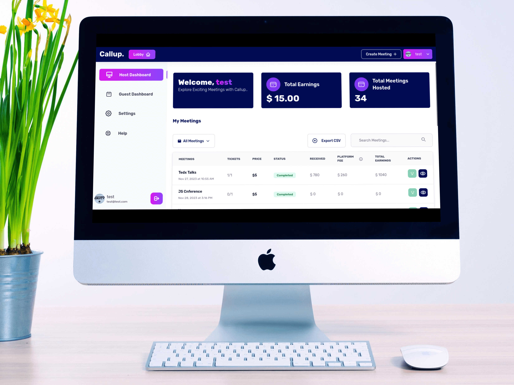
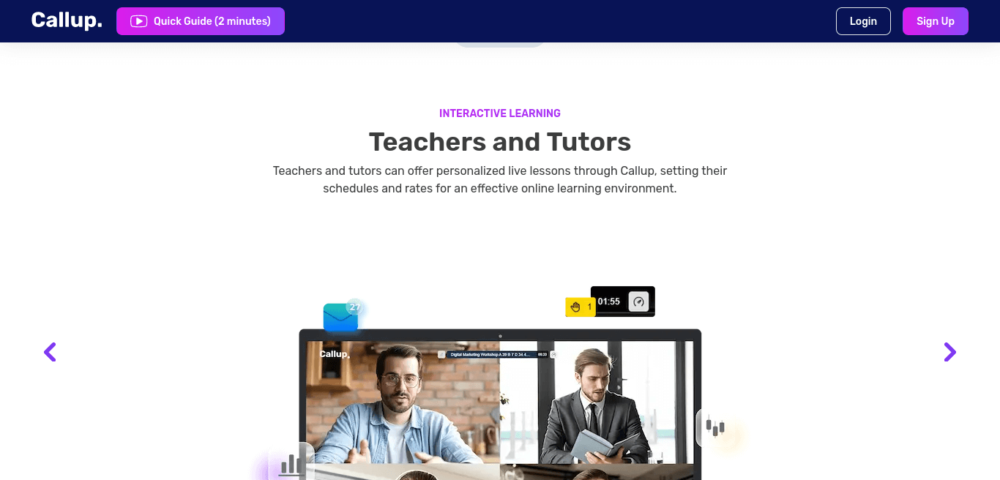
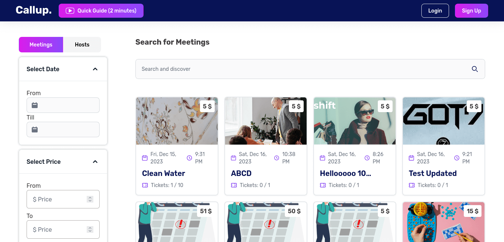
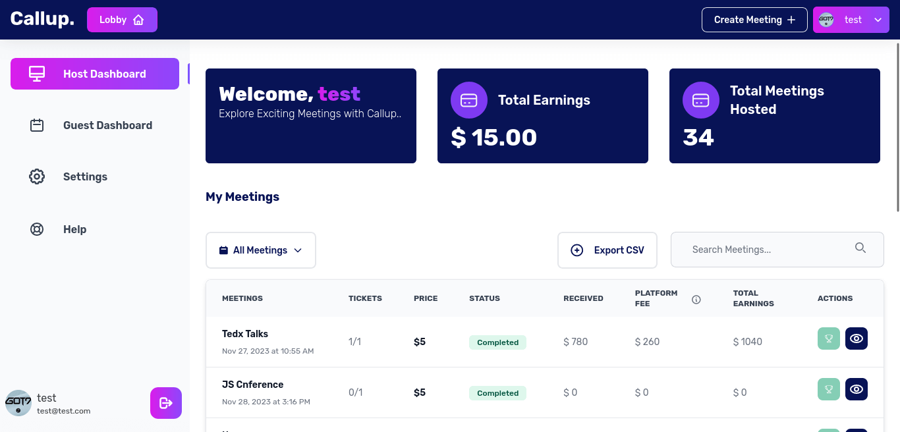

# Callup - The Ultimate Video Call Platform

Built from the ground up, Callup is an exceptional video call platform that I've crafted to provide a seamless and feature-rich experience for users. This platform allows any user to register as a host, create public or private meetings, and set prices for participants to join. With a focus on security and convenience, participants must purchase tickets to join meetings, and private sessions are protected by passwords. Leveraging a powerful tech stack, including AWS services, Stripe Connect, NextJS and Jitsi, Callup offers a secure, efficient, and visually appealing environment for virtual interactions.

## Features

- **Host and Earn:** Register as a host, create public or private meetings, and set prices for participants to join.

- **Diverse Expertise:** Connect with influencers and professionals across various fields for personalized advice.

- **Ticketing System:** Ensure secure and seamless entry to meetings by requiring participants to purchase tickets.

- **Private Meetings:** Enhance security with private meetings, requiring a password for participants to join after purchasing tickets.

- **AWS Integration:** Leverage AWS services, including AWS RDS, Cognito & Lambda for authentication, S3 for image uploads, and CDK for deployment.

- **Earnings Distribution:** Upon purchasing a ticket, a specific platform amount is deducted and the remaining is seamlessly transferred to the host.

## Technologies

- **Backend:** NestJS (Express) for server-side development, PostgreSQL as the database, AWS RDS for hosting PostgreSQL, AWS Cognito & Lambda for authentication, and AWS CDK for deployment.

- **Frontend:** NextJS (TypeScript) v13 for building a responsive and performant user interface.

- **State Management:** Zustand for efficient state management in the frontend.

- **Video Calls:** Jitsi for reliable and secure video calls and meetings.

- **Data Fetching:** Tanstack/React Query combined with Axios for efficient data fetching and API interactions.

- **Styling:** Tailwind CSS & Flowbite for a modern and visually appealing design.

## Live Project

Explore the live version of Callup at [callup.live](https://callup.live/).

## Attachments

_Describing use cases of callup with carousel_

_Search & filter meetings and hosts_

_Analytics for host and their meetings_
